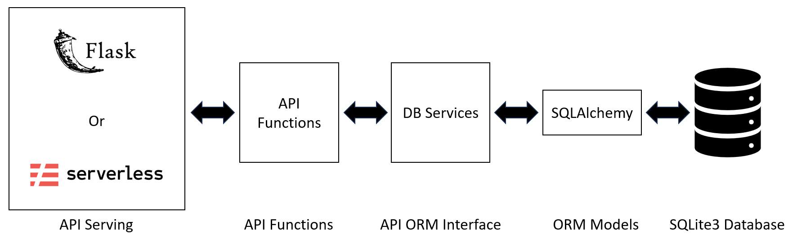
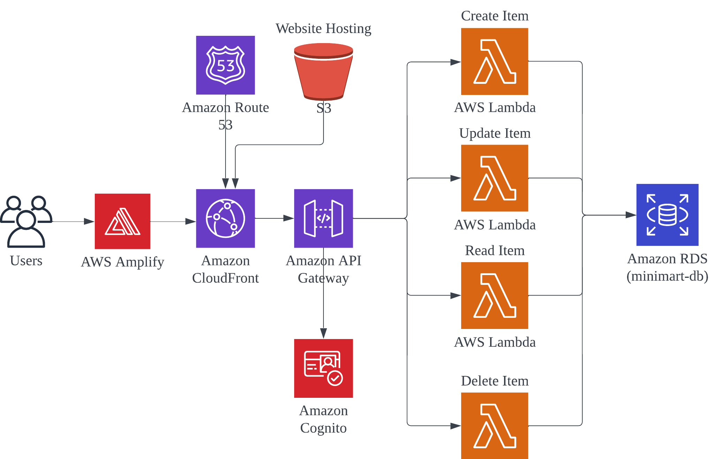

# Pat's Online Minimart

---

## Introduction

This is an online minimart application done as part of GovTech's CSG DARE TAP application.
The minimart has basic CRUD functionality of items it sells and has 2 main views:

1. User view for users to purchase items from minimart.
2. Admin view for admins to manage items in minimart.

## Requirements
* Backend
  * [Python 3.8](https://www.python.org/downloads/release/python-380/)
* Frontend
  * [NodeJS](https://nodejs.org/en/download)
* If deploying to cloud:
  * [NodeJS](https://nodejs.org/en/download)
  * [Serverless Framework](https://www.serverless.com/framework/docs/getting-started)
  * [Serverless offline](https://www.serverless.com/plugins/serverless-offline#installation)

## Getting Started

First deploy the backend (Either using Flask or Serverless Offline), followed by the frontend.

### Pre-deployment Steps
1. Download this repository.
2. `cd backend`.
3. `pip install -r requirements.txt`.
   1. If intending to run using Serverless offline (not recommended as the extra steps below are needed).
   2. `npm install -g serverless`
   2. `npm install serverless-offline --save-dev`
   3. `serverless offline --help` to check that Serverless Offline is installed.
4. `cd ../frontend`.
5. `npm install`.

### Backend

You can choose to deploy the backend using Flask (recommended for evaluating the app), or using Serverless offline.

#### Deploying using Flask (Recommended for straightforward deployment)
1. In a terminal, from the root of this repository, `cd backend`.
2. Run `flask --app main run`.

#### Deploying using Serverless Offline
1. In a terminal, from the root of this repository, `cd backend`.
2. Run `serverless offline --httpPort 5000`.

### Frontend
1. In another terminal, from the root of this repository, `cd frontend`.
2. Run `npm start`.

---

## Developer Notes

### Backend

The backend is designed using Serverless Framework offline in mind, but can be deployed using Flask. 
[SQLAlchemy](https://www.sqlalchemy.org/) is the chosen ORM used to interact with the database (SQLite3). 
A high level diagram of the backend architecture is shown below:

With reference to the diagram above, item data is stored in the sqlite3 database. 
SQLAlchemy models are then created to model the database. 
DB Services are python functions that are used to abstract out SQLAlchemy logic from API Functions.
API Functions are functions directly called by the backend API. 
These functions are served using either Flask or Serverless Offline.

Some notes on files/directories and their respective uses:
* `/backend/db` contains: 
  * ORM database models (`models/`).
  * Code to create SQLite3 database and initialize sessions (`database.py`).
  * Database file will be found here upon initialization (`pat_minimart.db`).
* `/backend/src/functions` contains: 
  * Functions called by API endpoints (Currently only for minimart item CRUD). These functions are directly referenced in `serverless.yml`.
* `/backend/src/services` contains:
  * Contains DB Services that are used to abstract out ORM code from API function calls.
* `/backend/utils` contains: 
  * Contains functions used to validate items received from API calls before the items are used to update the database (`validators.py`).
  * Contains standard API responses (`standard_responses.py`).

### Frontend

The frontend is created using React and consists of 3 main pages:

1. `Home`: Landing page for the frontend. Allows users to choose between the admin and client interfaces. Would ideally be substituted with a proper login page.
2. `UserPage`: Main client interface. Allows for customers of the minimart to browse and buy items.
3. `AdminPage`: Main admin interface. Allows for Pat and his employees to manage items displayed in the minimart.

## Deployment to Cloud

The diagram below gives a big overview of how the app will look like if it is deployed to AWS.

Details are elaborated below with reference to this diagram.

### Backend

This backend of this application can be deployed to the cloud with minimal modifications using Serverless Framework, as specified below:

1. Database should be changed from SQLite3 to a relational database hosted on the cloud (E.g. RDS for AWS).

After this modification has been made, Serverless Framework allows us to easily deploy to the cloud. 
Functions specified in `serverless.yml` will become serverless, event-driven code (Lambda functions in AWS). 
In the case of this app, functions in `backend/src/functions/web/api/v1` will be transformed into Lambda functions. 
The Framework will also create an API gateway. 
The gateway can then be associated with a domain (E.g. Using Route53 in AWS) to expose the backend APIs to the internet.

### Frontend

The Frontend of this application can be deployed to the cloud using a hosting service such as AWS Amplify, with the 
static frontend code being stored in a storage service like AWS S3. 
Additionally, an authentication service like AWS Cognito can be used to authenticate users of the app, to improve security.

## Security hardening techniques on the cloud

Cloud security is an important aspect of using cloud services and is a continuous process of finding and rectifying security lapses and vulnerabilities. 
The few points listed below will are a few key points that should be followed when maintaining a cloud environment. 
As a company grows, the infrastructure used will grow, resulting in more security lapses in one's cloud environment. 
When this happens, prioritizing which risks to resolve first becomes an important issue.

1. Principle of least privileges, IAM Groups
   * Users should only have privileges to do things they are supposed to do, nothing more, nothing less.
   * IAM groups will be useful to allocate privileges (IAM Roles) to users.
2. Whitelisting, Security Groups
   * Whitelisting inbound connections to only allow communication between instances that need to communicate.
   * Use of Security Groups to manage these connections between instances.
3. Automated Backups, Logging
   * Always have a backup copy of important instances such as databases or compute instances (EC2).
   * Automate the backing up process and management of backups (E.g. Create a snapshot of a database every week)
   * Always enable logging and manage logs using policies (E.g. Moving logs to AWS archive after 30 days).
4. Load Balancing, Availability Zones
   * Use a load balancer to scale your application up or down based on server load.
   * Spread instances across multiple availability zones and regions to strengthen against catastrophic failure.
5. VPCs, Subnets
   * Segment your cloud into multiple VPCs. VPCs can be further segmented into subnets, both private and public, to limit impact of potential security incidents.
6. Encryption
   * Encrypt data at rest to prevent people from reading the data without appropriate clearance.
7. Updates, Vulnerability Management
   * Ensure instances in your cloud are updated and scanned regularly for vulnerabilities.

## API List

* Get a list of all items in minimart
  * Endpoint: `/web/api/v1/items`
  * Method: `GET`
* Get a specific item in minimart by ID
  * Endpoint: `/web/api/v1/item/<id>`
  * Method: `GET`
* Create a new item
  * Endpoint: `/web/api/v1/items`
  * Method: `POST`
  * Body: `{"name": <item name>, "qty": <item_quantity>, "price": <item_price>}`
* Update an item in the minimart
  * Endpoint: `/web/api/v1/items/<id>`
  * Method: `PUT`
  * Body: `{"name": <item name>, "qty": <item_quantity>, "price": <item_price>}`
    * Only fields to be updated are required in body.
* Update multiple items in the minimart
  * Endpoint: `web/api/v1/items`
  * Method: `PUT`
  * Body: `[{"id": <item_id>, "name": <item name>, "qty": <item_quantity>, "price": <item_price>}]`
    * Only id field is required, all other fields are not necessary.
    * Can have multiple dictionaries in the body.
* Remove an item from the minimart
  * Endpoint: `web/api/v1/items/<id>`
  * Method: `DELETE`
